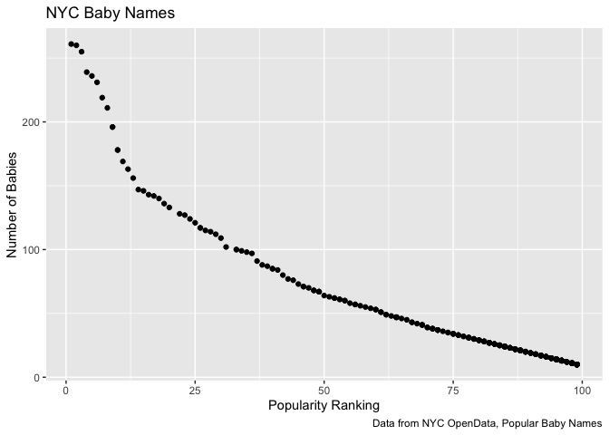

================
Laura Lynch

Homework 2
=========

Read and clean Mr. Trashwheel: data/~$HealthyHarborWaterWheelTotals2018-7-28.xlsx

``` r
trash_data = 
  readxl::read_excel("data/Trash-Wheel-Collection-Totals-8-6-19.xlsx",
    sheet = "Mr. Trash Wheel",
    range = "A2:N338",
    ) %>% 
  janitor::clean_names(dat = .) %>% 
  drop_na(data = ., dumpster) %>% 
  mutate( 
        sports_balls = as.integer(sports_balls, round, 0)
        )
```

Read and clean precipitation data:

``` r
rain_2018 = 
  readxl::read_excel("./data/HealthyHarborWaterWheelTotals2018-7-28.xlsx",
    sheet = "2018 Precipitation", skip = 1, col_names = TRUE) %>%
    janitor::clean_names() %>%
  drop_na(total, month) %>%
  mutate(year = 2018)

rain_2017 = 
  readxl::read_excel("./data/HealthyHarborWaterWheelTotals2018-7-28.xlsx",
    sheet = "2017 Precipitation", skip = 1, col_names = TRUE) %>%
    janitor::clean_names() %>%
  drop_na(total, month) %>%
  mutate(year = 2017)

rain_tidy = 
  bind_rows(rain_2018, rain_2017) %>%
  mutate(month = as.numeric(month), month = month.name[month]) %>%
  janitor::clean_names() %>%
  select(year, month, total) 
```

About the data:

-   The Mr. Trashwheel is collected from 286 dumpsters
    -   Measurements are collected for 14 types of debris pulled from the ocean
        -   For example the median number of sports balls removed was 8
        -   And a median of 1240 grocery bags
    -   In total 3.325 tons of garbage was removed since 2014!
-   The 2017-2018 precipitation data has 19 observations
    -   The total precipitation for 2017 was 32.93 inches
    -   The total precipitation for 2018 was 23.5 inches

Problem 2
=========

Clean and tidy pols-month:

``` r
pols_month = readr::read_csv("data/pols-month.csv") %>%
  janitor::clean_names() %>%
  separate(mon, into = c("year", "month", "day"), sep = "-", convert = TRUE) %>%
  mutate(month = month.abb[month]) %>%
  mutate(president = ifelse(prez_gop == 1, c("gop"), c("dem"))) %>%
  select(-prez_dem, -prez_gop, -day) %>%
  arrange(year, month)
```

    ## Parsed with column specification:
    ## cols(
    ##   mon = col_date(format = ""),
    ##   prez_gop = col_double(),
    ##   gov_gop = col_double(),
    ##   sen_gop = col_double(),
    ##   rep_gop = col_double(),
    ##   prez_dem = col_double(),
    ##   gov_dem = col_double(),
    ##   sen_dem = col_double(),
    ##   rep_dem = col_double()
    ## )

Clean and tidy snp:

``` r
snp = readr::read_csv("data/snp.csv") %>%
  janitor::clean_names() %>%
  separate(date, into = c("day", "month", "year"), sep = "/", convert = TRUE) %>%
  mutate(month = month.abb[month]) %>%
  select(-day) %>%
  select(year, month, close)
```

    ## Parsed with column specification:
    ## cols(
    ##   date = col_character(),
    ##   close = col_double()
    ## )

Clean and tidy unemployment:

``` r
unemployment = readr::read_csv("data/unemployment.csv") %>%
  janitor::clean_names() %>%
  pivot_longer(
    cols = jan:dec, 
    names_to = "month", 
    values_to = "percent_unemploy") %>%
    select(year, month) 
```

    ## Parsed with column specification:
    ## cols(
    ##   Year = col_double(),
    ##   Jan = col_double(),
    ##   Feb = col_double(),
    ##   Mar = col_double(),
    ##   Apr = col_double(),
    ##   May = col_double(),
    ##   Jun = col_double(),
    ##   Jul = col_double(),
    ##   Aug = col_double(),
    ##   Sep = col_double(),
    ##   Oct = col_double(),
    ##   Nov = col_double(),
    ##   Dec = col_double()
    ## )

Merge the three datasets:

``` r
# merge snp into pols
merge_1 = 
  right_join(pols_month, snp, by = c("year", "month"))

# merge unemployment into merge_1
full_merge = 
  left_join(merge_1, unemployment, c("year", "month"))
```

The"pols\_month" dataset tracks the political affiliations of national leaders monthly including president, senators and governers for a total of 822 months. The "snp" dataset tracks the closing values of the Standard & Poors stock from 1950 to 2015. Finally, the "unemployment" dataset tracks the percentage unemployment by month from 1948 to 2015.

Once merged, these data represent 787 observations and 10 variables. The data collected range frorm 1950 to 2015. It is possible to see how many democrats and republicans hold high office, including the political affiliation of the president, and a break down of S&P closing values by month. The mean S&P clsoing value was 474.8887404, the median S&P closing value was 138.529999 and the standard deviation was 545.9569797.

Problem 3
=========

Load and tidy data:

``` r
baby_names = readr::read_csv("data/Popular_Baby_Names.csv") %>%
  janitor::clean_names() %>%
  select(year = year_of_birth, 
         name = childs_first_name, 
         everything()) %>%
  mutate(name = str_to_lower(name)) %>%
  mutate(ethnicity = recode(ethnicity, 
         "ASIAN AND PACI" = "ASIAN AND PACIFIC ISLANDER",
         "BLACK NON HISP" = "BLACK NON HISPANIC", 
         "WHITE NON HISP" = "WHITE NON HISPANIC" 
         )) %>%
  distinct(name, year, ethnicity, .keep_all = TRUE)
```

    ## Parsed with column specification:
    ## cols(
    ##   `Year of Birth` = col_double(),
    ##   Gender = col_character(),
    ##   Ethnicity = col_character(),
    ##   `Child's First Name` = col_character(),
    ##   Count = col_double(),
    ##   Rank = col_double()
    ## )

Olivia's Table:

``` r
baby_names %>% 
  filter(name == "olivia", gender == "FEMALE") %>%
  select(-count, -gender) %>%
  group_by(ethnicity) %>%
  pivot_wider(
   names_from = "year", 
   values_from = "rank") %>%
  knitr::kable() 
```

| name   | ethnicity                  |  2016|  2015|  2014|  2013|  2012|  2011|
|:-------|:---------------------------|-----:|-----:|-----:|-----:|-----:|-----:|
| olivia | ASIAN AND PACIFIC ISLANDER |     1|     1|     1|     3|     3|     4|
| olivia | BLACK NON HISPANIC         |     8|     4|     8|     6|     8|    10|
| olivia | HISPANIC                   |    13|    16|    16|    22|    22|    18|
| olivia | WHITE NON HISPANIC         |     1|     1|     1|     1|     4|     2|

Boy's Table:

``` r
baby_names %>% 
  filter(gender == "MALE", rank == 1) %>%
  select(-rank, -gender, -count) %>%
  group_by(ethnicity) %>%
  pivot_wider(
   names_from = "year", 
   values_from = "name") %>%
   knitr::kable() 
```

| ethnicity                  | 2016   | 2015   | 2014   | 2013   | 2012   | 2011    |
|:---------------------------|:-------|:-------|:-------|:-------|:-------|:--------|
| ASIAN AND PACIFIC ISLANDER | ethan  | jayden | jayden | jayden | ryan   | ethan   |
| BLACK NON HISPANIC         | noah   | noah   | ethan  | ethan  | jayden | jayden  |
| HISPANIC                   | liam   | liam   | liam   | jayden | jayden | jayden  |
| WHITE NON HISPANIC         | joseph | david  | joseph | david  | joseph | michael |

Make a scatterplot:

``` r
baby_names %>%
  filter(gender == "MALE", year == 2016, ethnicity == "WHITE NON HISPANIC") %>%
  ggplot(aes(x = rank, y = count)) + geom_point() + 
  labs(
    title = "NYC Baby Names",
    x = "Popularity Ranking",
    y = "Number of Babies",
    caption = "Data from NYC OpenData, Popular Baby Names"
  )
```


